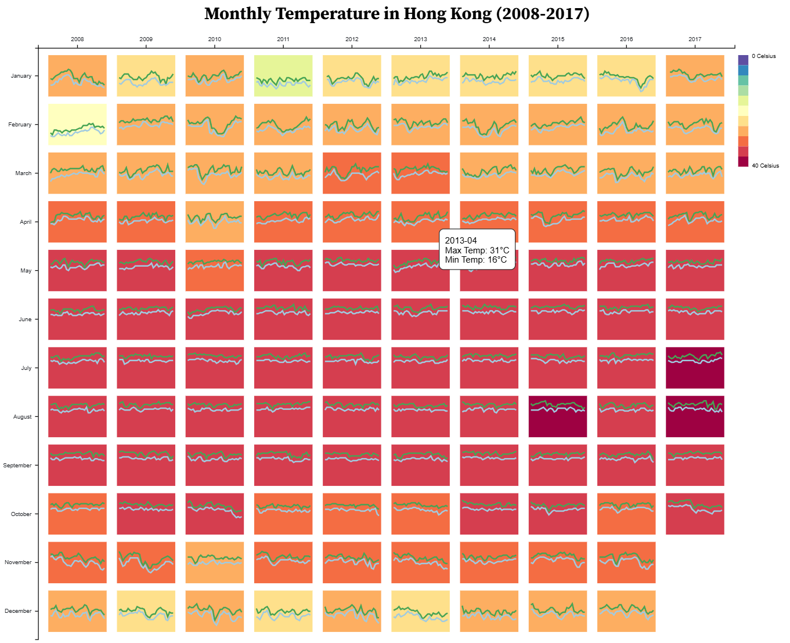

# Spring26-CSCE679-Assignment-1

## Submission

This assignment is written with D3.js in Observable. A result screenshot is attached above to demonstrate the final output of the implementation. To check the full implementation, here is the link to the Observable Notebook: https://observablehq.com/d/3b77d4cf58cbc5b7.

## AI Usage

### ChatGPT interaction log

+ https://chatgpt.com/share/6997ee28-3f38-8006-bda4-72e75f9b5cfb

### My Reflection

In this assignment, I used AI to assist me in writing my first piece of D3.js code. The AI was particularly helpful during the early stages of development, including importing the dataset from GitHub, parsing and filtering the data, and drafting the initial structure of the target visualization. Having a generated starting point significantly lowered the barrier to getting started with D3 and helped me quickly understand the overall workflow.

However, I also found that AI assistance has limitations when dealing with more subtle bugs or unexpected behaviors in the code. In these cases, the AI was sometimes unable to precisely identify the root cause of the problem. As a result, I still needed to carefully inspect the code, reason through the logic, and debug minor issues on my own. Overall, AI served as an effective tool for scaffolding and accelerating development, but a solid understanding of the code was still essential for troubleshooting and refinement.
